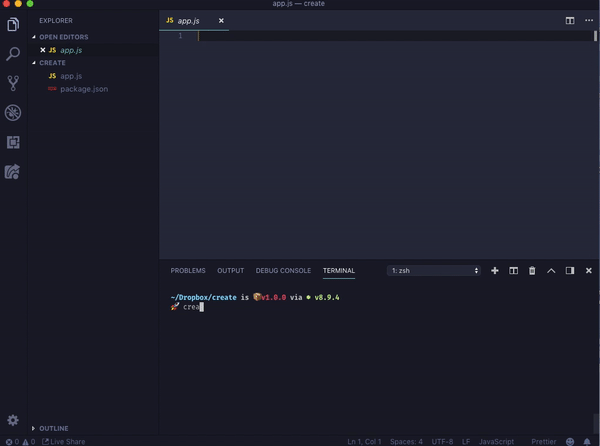

# create



simple library to create component templates for React and React native projects.

## install

```sh
$ git clone https://github.com/obiwankenoobi/create.git
$ cd /create
$ npm run build

```

##

## use

From your project directory

```sh
create <type> [platform] [name]
```

## params


| param      | options               | description                                                                                         |
| ---------- | --------------------- | --------------------------------------------------------------------------------------------------- |
| `type`     | `co` / `sc` / `redux` | what to create (component inside `/src/components`, screen inside `/src/screens` or redux template) |
| `platform` | `rc` / `rn`           | for what platform `react` or `react-native`                                                         |
| `name`     | `String`              | what name to give the component                                                                     |


**note** When using `rn` you will get a file configured with `connect` module of `react-redux` by default

## Enjoy ! (:
